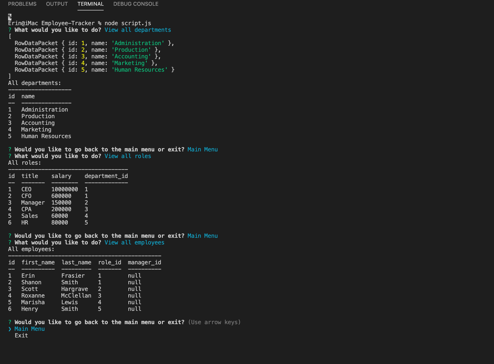

# Employee Tracker

Allows an employer to view their departments, roles and employees. They can also add a department, role or employee and also update an employee role.

## Table of Contents 

- [Technologies](#tech)
- [Instalation](#install)
- [Usage](#output)
- [Contribute](#contribute)
- [Questions](#email)
- [License](#license)

### Technologies

 The technologies utilized in this application are as follows: Inquirer, and Node.

### Instalation

 To run this application successfully follow these steps:
  1. Install [Employee-Tracker]( https://erinmarie84.github.io/Employee-Tracker) to your local drive via terminal/GitBash. This will install the package.json file which contains a list of all the dependencies for this application. 

  2. Verify that node is installed on your computer by typing 'node' in your terminal/GitBash. If it returns
    >Welcome to Node.js V12.14.1 (or higher)
    >
    >Type '.help' for more information.

    Node.js is installed on your computer.
  3. Type 'npm install' in your terminal to install the dependencies. 

### Usage

 The purpose of this program is to solve It gives the user easy access to their employee database and makes it easy to keep track of their employees, their roles and departments. The following is the expected output of the application: The app will allow the user to put employee information into a database. They can then view all employees, roles and departments. They can add a department, role or employee and also update an employee's role.

### Contribute
 
 Contrubutions are to this application are welcome to imporve it's functionality. If you would like to contribute to this application please contact me at the email address listed in the questions section.

### Questions

 Any questions and/or comments are welcome. Please contact me at e_marie84@ymail.com or visit my [Github Profile](https://github.com/erinmarie84)

 ### License

 Licensed under the MIT license. 
